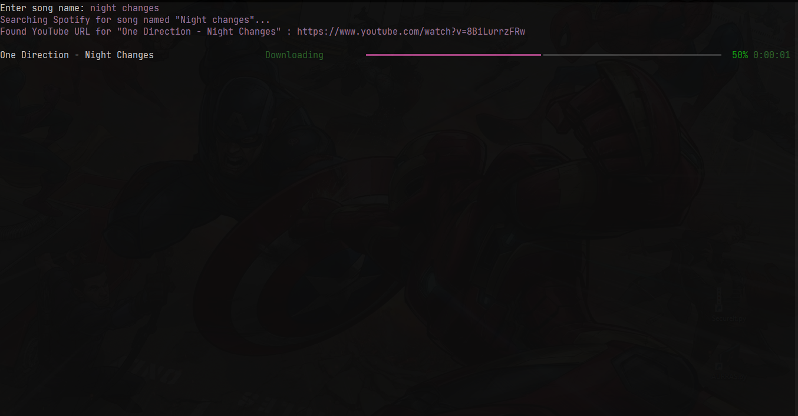

# Aurras


**Aurras🎧** is a high end **command line music player**.
It lets you play any song you want.

**It has a sleek simple to use interface.**

# How It Works

**Search Bar**


**Playing Song - Shape Of You**


<br>

**Downloading Song - Night Changes**


<br>


# Features

* **play song online** directly, without downloading
* **downlaod song**
* A powerful feature called **Shuffle Play**
* User can create his/her own **personalised playlists**
* **Auto Corrects** the song name
* Shows **Lyrics** of the song while playing

<!-- 
# Creating Playlist

User can create his/her own personalised playlist.<br> he/ she can add/ remove a song  -->


# Installation

```pip install -r requirements.txt```


```choco install ffmpeg```


```scoop install ffmpeg```